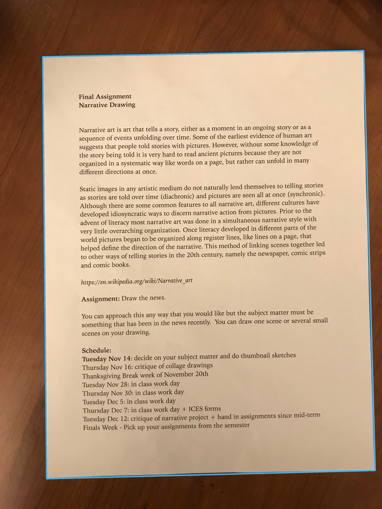
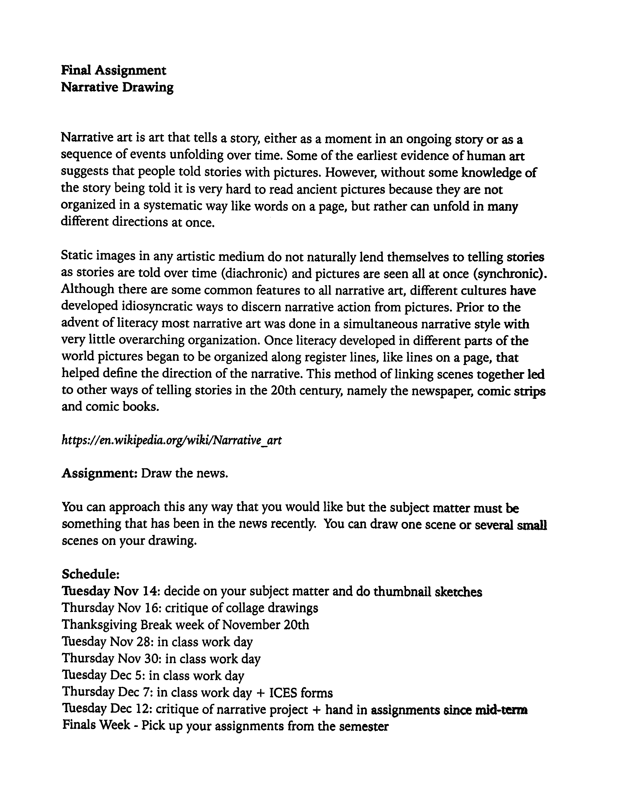
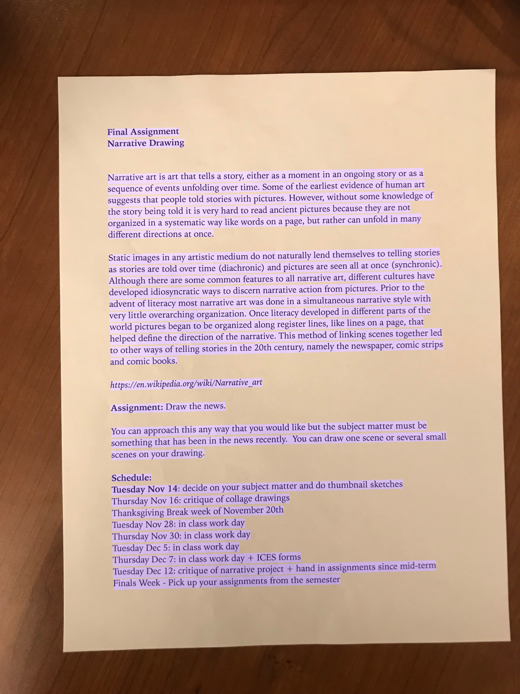
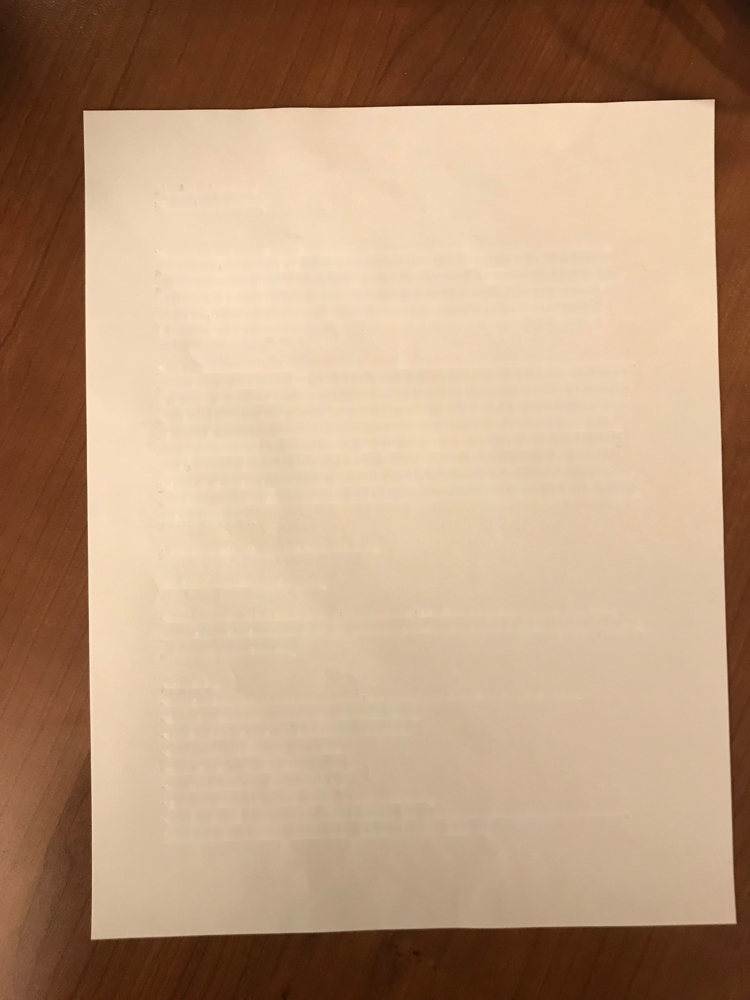
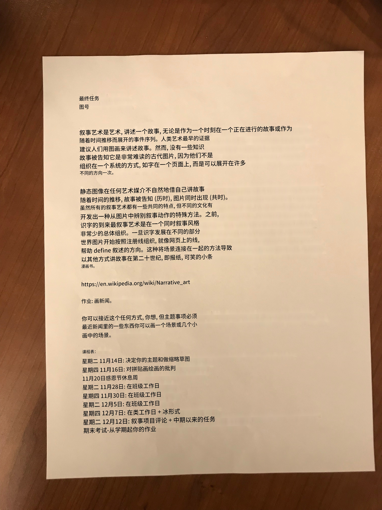

# Scanner
Scans documents using your camera :)

## Installation

```sh
# install python modules
pip3 install -r requirements.txt
# install tesseract (OCR dependency)
# Example: MacOS
# See https://github.com/tesseract-ocr/tesseract for more details
brew install tesseract --with-all-languages
```

## Run the Scanner
```sh
python3 main.py <your_image_file>
```

The output will be stored in `./result/` directory

## Demo
Input Image:


Boundary Recognition:


Transform using homography:


Recognize text location:


Remove text from background:


Translate and transform the translated text using reverse homography:


Merge the text back to the background
